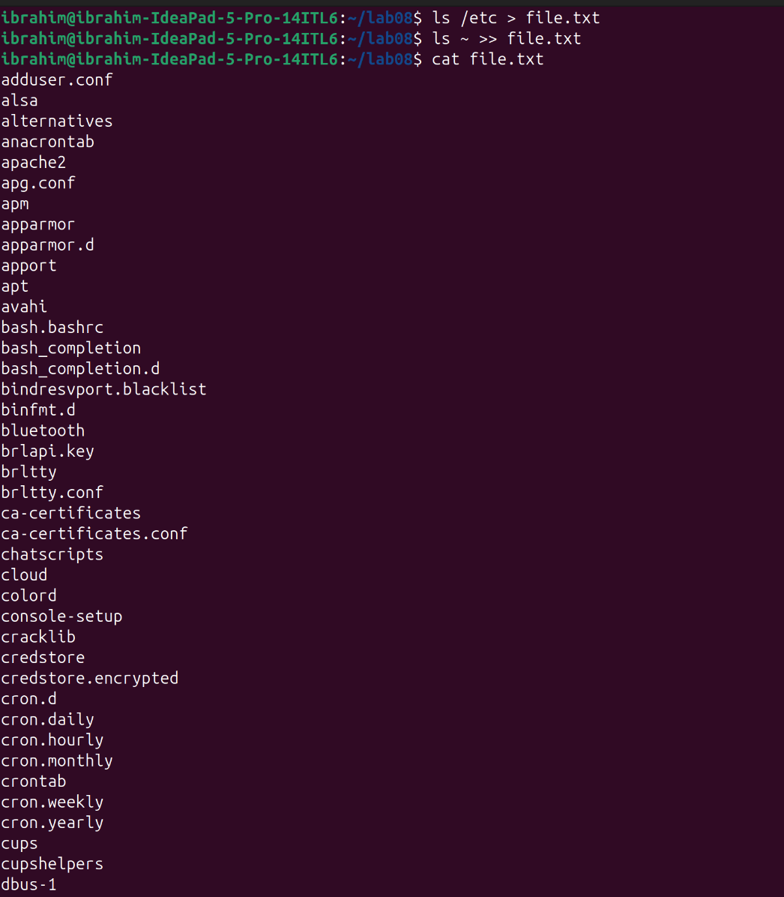
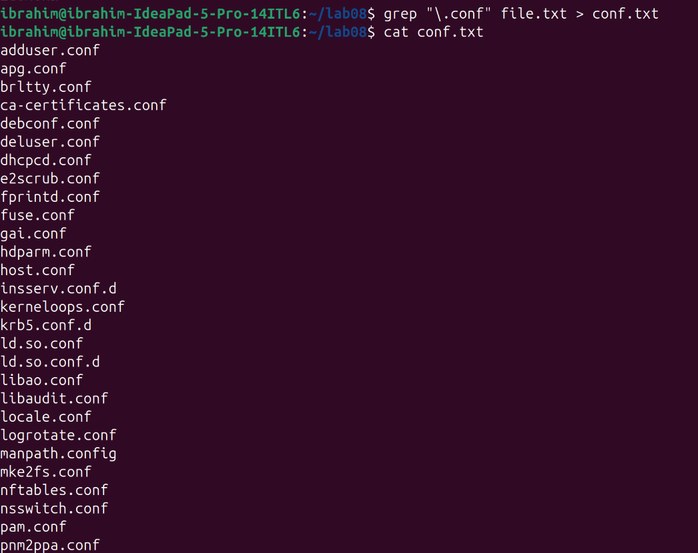
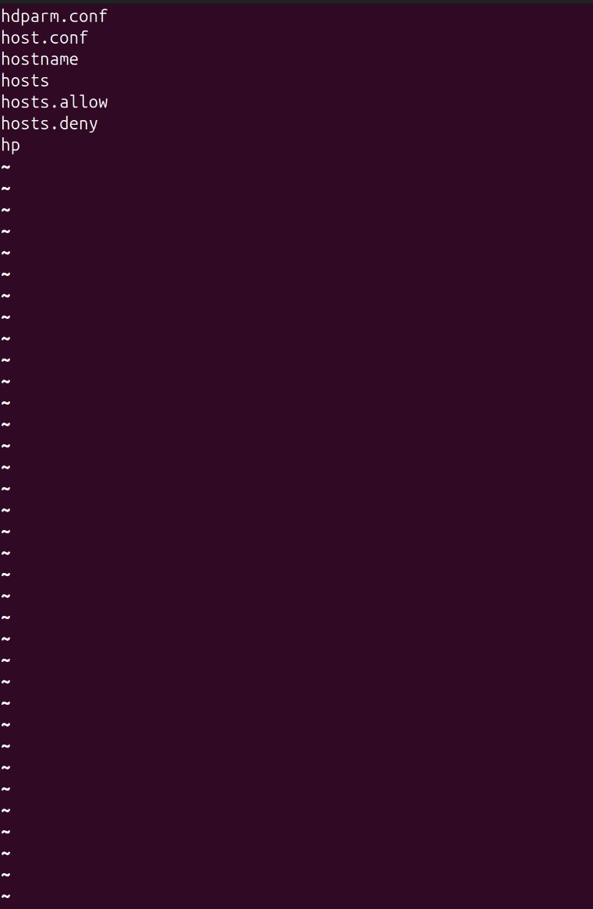
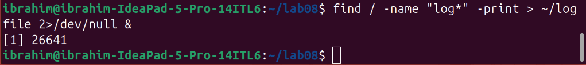
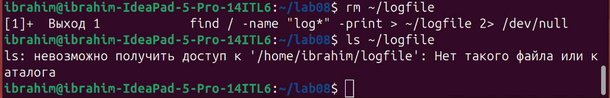
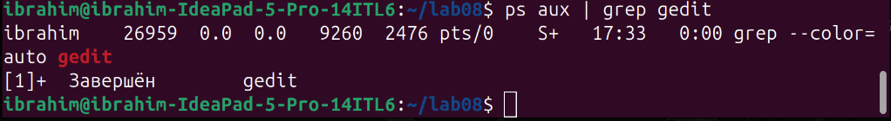
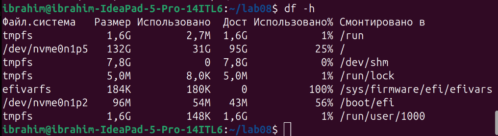
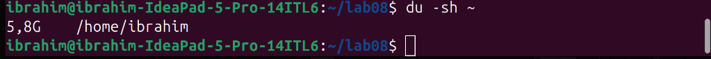

# Лабораторная работа №8
## Поиск файлов. Перенаправление ввода-вывода. Просмотр запущенных процессов

**Студент:** Ибрахим Хиссеин Гана  
**Дата:** 04.04.2026

## Цель работы
Ознакомление с инструментами поиска файлов, фильтрации текста, перенаправлением ввода-вывода и управлением процессами.

## Выполнение работы

### 1. Создание file.txt
`ls /etc > file.txt`  
`ls ~ >> file.txt`  

### 2. Фильтрация .conf
`grep "\.conf" file.txt > conf.txt`  

### 3. Поиск файлов на "c"
`ls ~ | grep "^c"`  

### 4. Вывод /etc/h* через less
`ls /etc | grep "^h" | less`  

### 5. Фоновый процесс find
`find / -name "log*" -print > ~/logfile 2>/dev/null &`  

### 6. Удаление logfile
`rm ~/logfile`  

### 7. Управление процессом gedit
`gedit &`  
`ps aux | grep gedit`  
`kill <PID>`  

### 8. df и du
`df -h`  
  
`du -sh ~`  

### 9. find -type d
`find ~ -type d`  

## Выводы
В ходе работы изучены команды: `grep`, `find`, `df`, `du`, `ps`, `kill`, а также перенаправление ввода-вывода (`>`, `>>`) и конвейеры (`|`). Получены навыки управления процессами и поиска файлов.

## Ответы на контрольные вопросы

### 1. Какие потоки ввода вывода вы знаете?
В Linux существует три стандартных потока:
- **stdin** (0) – стандартный ввод (клавиатура)
- **stdout** (1) – стандартный вывод (экран)
- **stderr** (2) – стандартный вывод ошибок (экран)

### 2. Объясните разницу между операцией `>` и `>>`.
- `>` – перенаправляет вывод в файл, **перезаписывая** его содержимое.
- `>>` – перенаправляет вывод в файл, **добавляя** новые данные в конец.

### 3. Что такое конвейер?
Конвейер (`|`) позволяет передавать вывод одной команды на ввод другой.  
Пример: `ls -la | grep ".conf"`

### 4. Что такое процесс? Чем это понятие отличается от программы?
- **Программа** – статичный набор инструкций, хранящийся на диске.
- **Процесс** – экземпляр выполняющейся программы с собственным PID, памятью и ресурсами.

### 5. Что такое PID и GID?
- **PID** (Process ID) – уникальный идентификатор процесса.
- **GID** (Group ID) – идентификатор группы, к которой принадлежит процесс.

### 6. Что такое задачи и какая команда позволяет ими управлять?
Задачи (jobs) – это процессы, запущенные из текущего сеанса оболочки.  
Команда `jobs` показывает их список. Управление: `fg`, `bg`, `kill %номер`.

### 7. Найдите информацию об утилитах top и htop. Каковы их функции?
- **top** – показывает активные процессы в реальном времени, использует ресурсы.
- **htop** – улучшенная версия top с цветным интерфейсом и управлением мышью.

### 8. Назовите и дайте характеристику команде поиска файлов. Приведите примеры использования этой команды.
Команда `find` ищет файлы по различным критериям.  
Примеры:  
`find ~ -name "*.txt"` – найти все `.txt` в домашнем каталоге.  
`find /etc -type d` – найти все каталоги в `/etc`.

### 9. Можно ли по контексту (содержанию) найти файл? Если да, то как?
Да, командой `grep -r "текст" /путь`.  
Пример: `grep -r "error" ~/logs/` – ищет слово "error" во всех файлах каталога.

### 10. Как определить объем свободной памяти на жёстком диске?
Команда `df -h` показывает размер, занятое и свободное место на всех смонтированных разделах.

### 11. Как определить объем вашего домашнего каталога?
Команда `du -sh ~` показывает общий размер домашнего каталога в человеко-читаемом формате.

### 12. Как удалить зависший процесс?
Сначала найти его PID (например, `ps aux | grep имя_процесса`), затем завершить командой `kill PID`.  
Если процесс не завершается, можно использовать `kill -9 PID`.
