# Лабораторная работа №9
## Командная оболочка Midnight Commander

**Студент:** Ибрахим Хиссеин Гана  
**Дата:** 11.04.2026

## Цель работы

Освоение основных возможностей командной оболочки Midnight Commander (mc). Приобретение навыков практической работы по просмотру каталогов и файлов; манипуляций с ними.

## Выполнение работы

### 1. Установка Midnight Commander

`sudo dnf install -y mc`

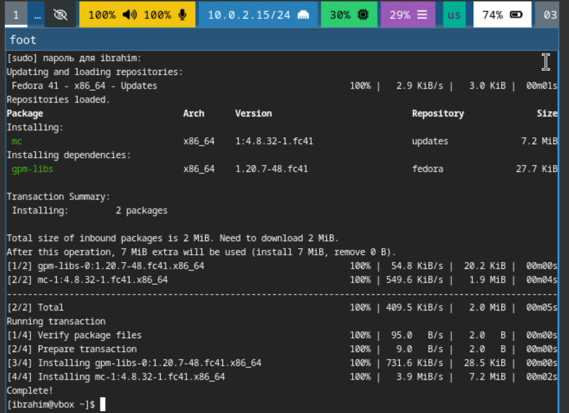

### 2. Запуск Midnight Commander

`mc`

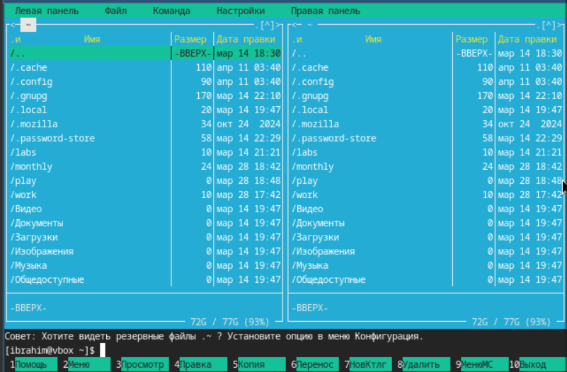

### 3. Режимы отображения панелей

#### 3.1. Режим "Информация"

`F9` → `Left` → `Info`

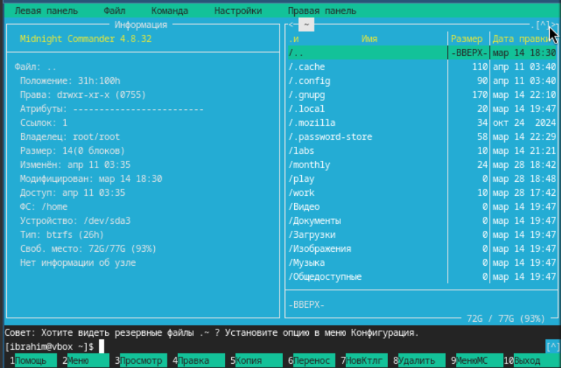

#### 3.2. Режим "Дерево"

`F9` → `Left` → `Tree`

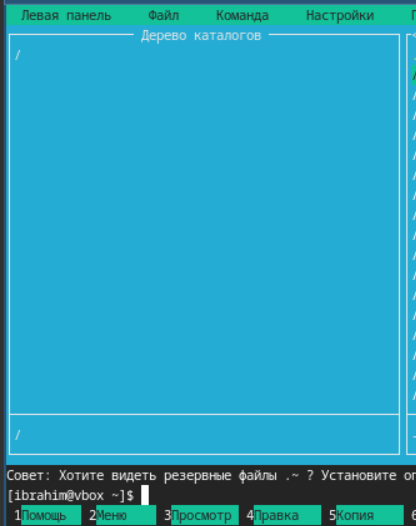

#### 3.3. Дерево каталогов

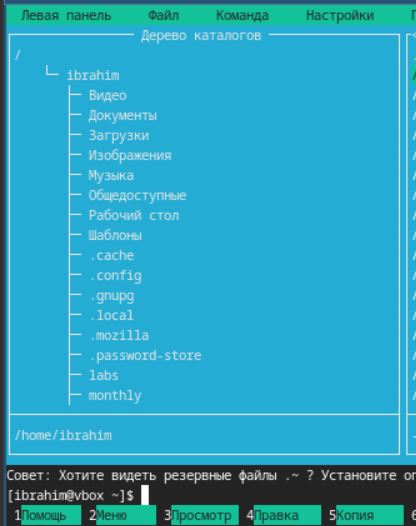

### 4. Навигация по файловой системе

#### 4.1. Корневой каталог `/`

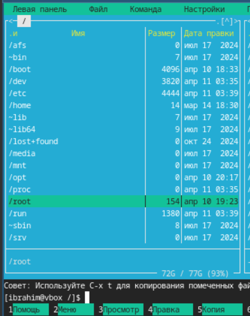

#### 4.2. Правая панель = `/var`

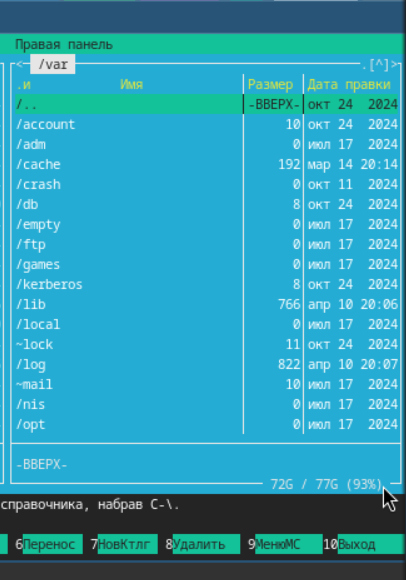

#### 4.3. Левая панель = `/etc`, правая панель = `/var`

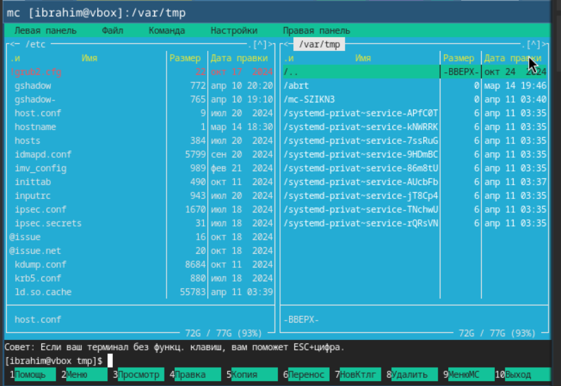

### 5. Копирование файла

#### 5.1. Правая панель = `/tmp`

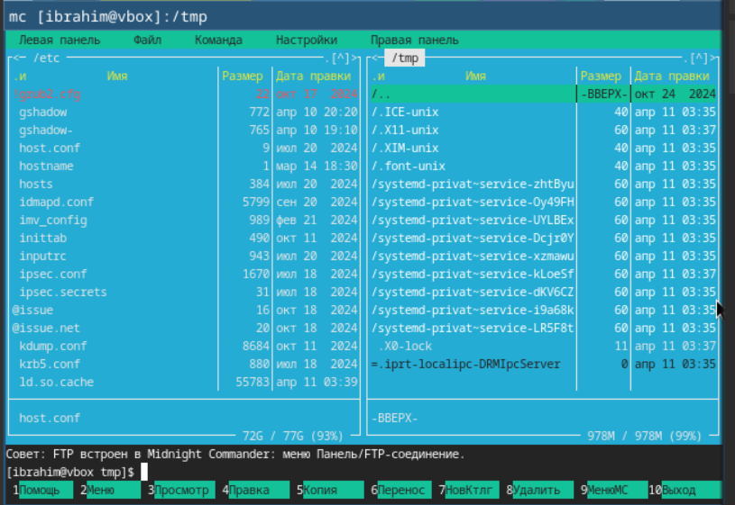

#### 5.2. Выбор `host.conf` в `/etc`

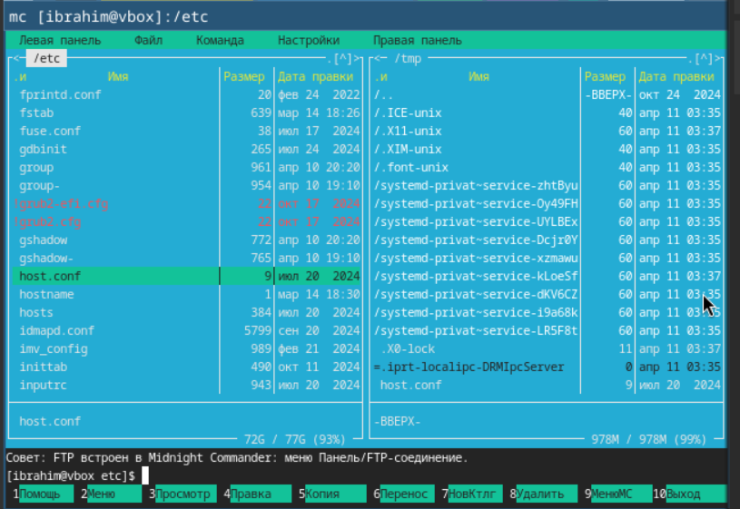

#### 5.3. Копирование в `/tmp`

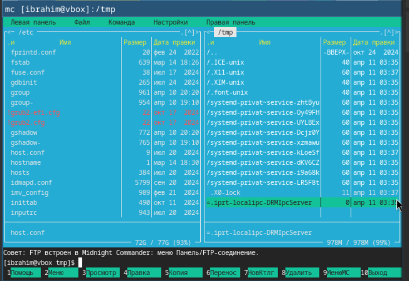

### 6. Создание каталога

`F7` → `test_mc`

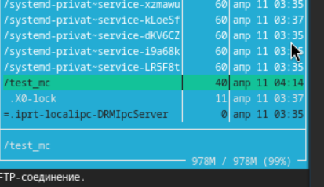

### 7. Поиск файлов

#### 7.1. Меню `Команда` → `Поиск файла`

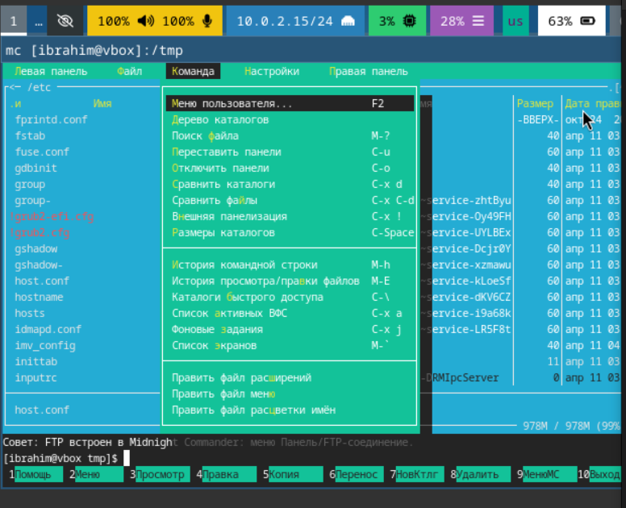

#### 7.2. Диалог поиска (начало)

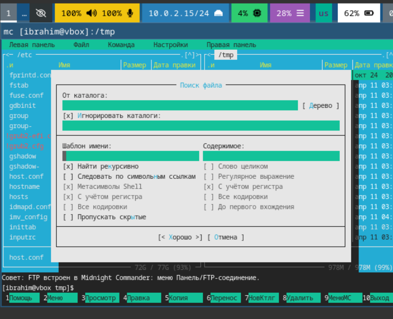

#### 7.3. Диалог поиска (почти заполнен)

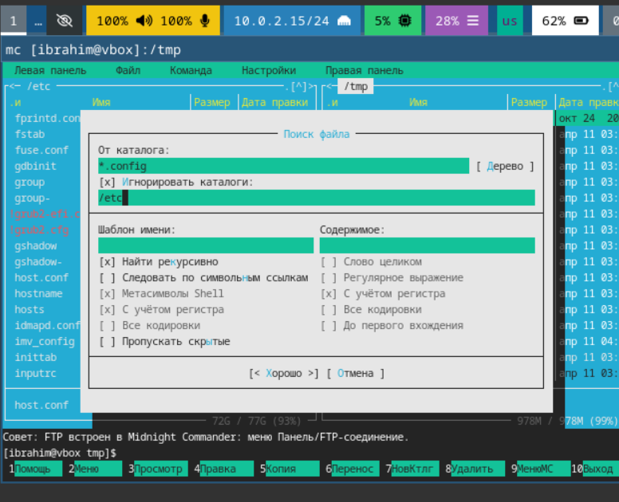

#### 7.4. Критерии поиска: `*.conf` в `/etc`

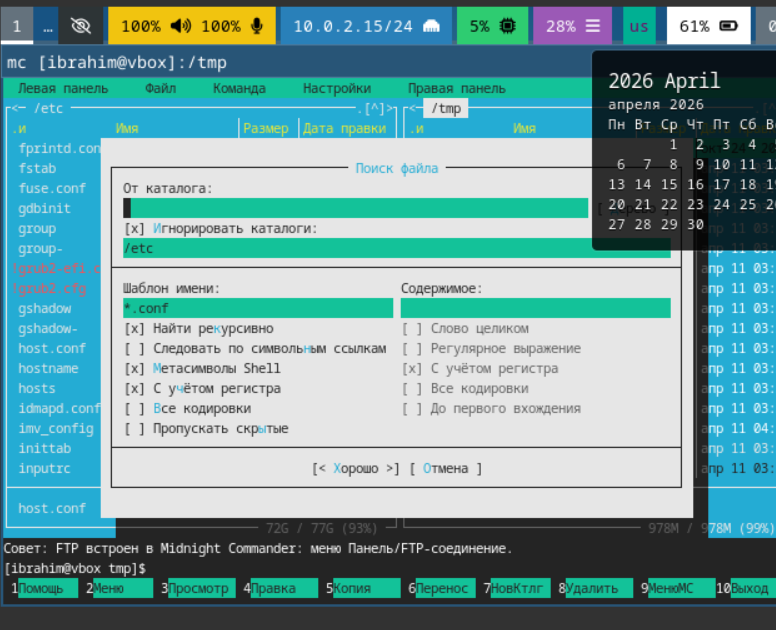

#### 7.5. Результат поиска

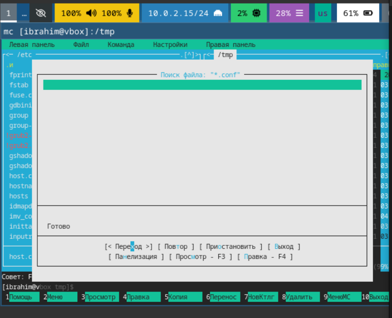

### 8. Редактирование файла во встроенном редакторе

`F4` на `host.conf`

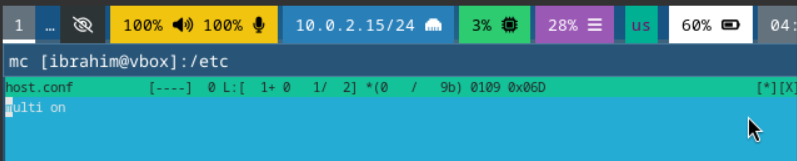

### 9. Справка Midnight Commander

`F1`

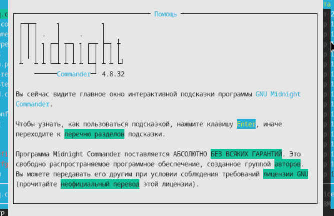

### 10. Выход из Midnight Commander

`F10`

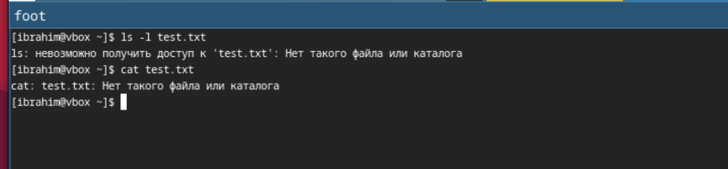

### 11. Проверка созданного файла

```bash
ls -l test.txt
cat test.txt

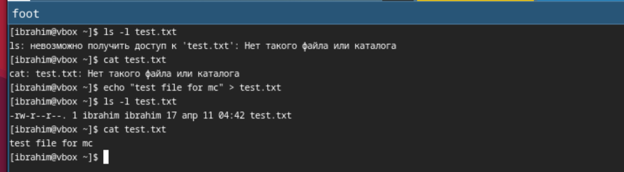

Выводы
В ходе работы были освоены основные возможности Midnight Commander:

навигация по файловой системе

копирование, перемещение, удаление файлов и каталогов

поиск файлов

использование встроенного редактора

работа с двумя панелями одновременно

Получены навыки эффективной работы с файловой системой в текстовом режиме.

Ответы на контрольные вопросы
1. Какие режимы отображения панелей есть в mc?
Список – стандартный режим

Информация – информация о файле/ФС

Дерево – древовидная структура каталогов

2. Какие операции с файлами можно выполнять как через shell, так и через mc?
Копирование (cp / F5), перемещение (mv / F6), удаление (rm / F8), создание каталога (mkdir / F7), изменение прав (chmod / меню).

3. Структура меню "Левая панель"
Список – обычный режим

Быстрый просмотр – просмотр файлов

Информация – информация о файле

Дерево – древовидный режим

Формат списка – настройка колонок

Фильтр – фильтрация файлов

4. Меню "Файл"
Просмотр (F3)

Правка (F4)

Копия (F5)

Переместить (F6)

Создать каталог (F7)

Удалить (F8)

5. Меню "Команда"
Дерево каталогов

Поиск файла

Переставить панели

Сравнить каталоги

Размеры каталогов

История командной строки

6. Меню "Настройки"
Конфигурация – общие настройки

Оформление – цвета

Настройки панелей

Подтверждения

Формат списка

7. Встроенные команды mc
F1 – помощь, F2 – меню, F3 – просмотр, F4 – правка, F5 – копия, F6 – переместить, F7 – создать каталог, F8 – удалить, F9 – меню, F10 – выход.

8. Команды встроенного редактора mc
F1 – помощь, F2 – сохранить, F4 – поиск, F6 – замена, F7 – перейти к строке, F10 – выход.

9. Как создать пользовательское меню?
Через F9 → Command → Править файл меню. Создаётся файл ~/.mc/menu.

10. Как выполнить произвольную команду над текущим файлом?
Использовать F9 → File → Править файл расширений или нажать Ctrl+Enter для вставки имени файла в командную строку.
