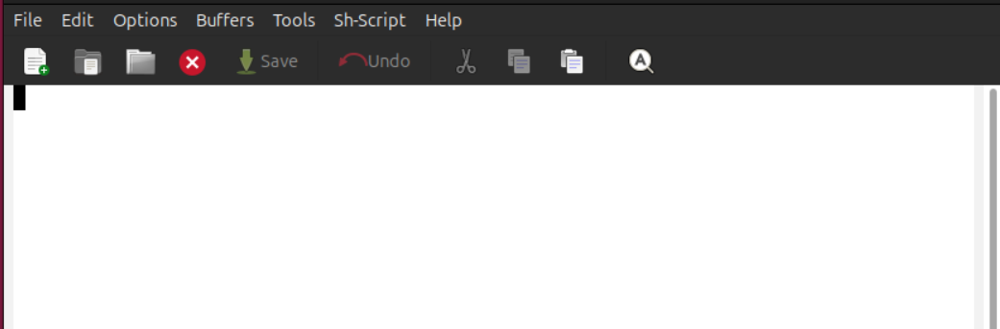
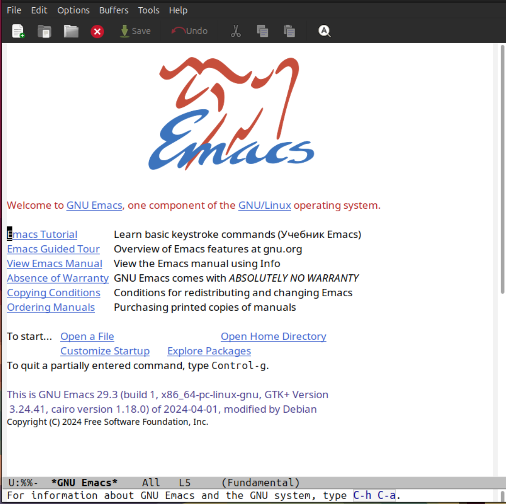
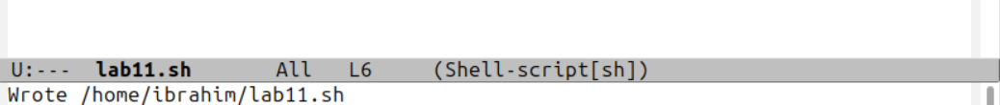
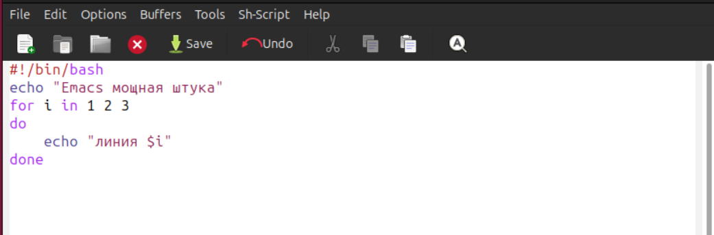
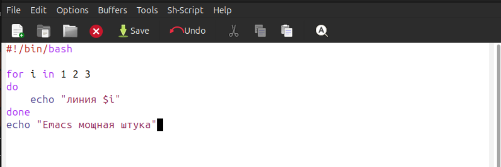
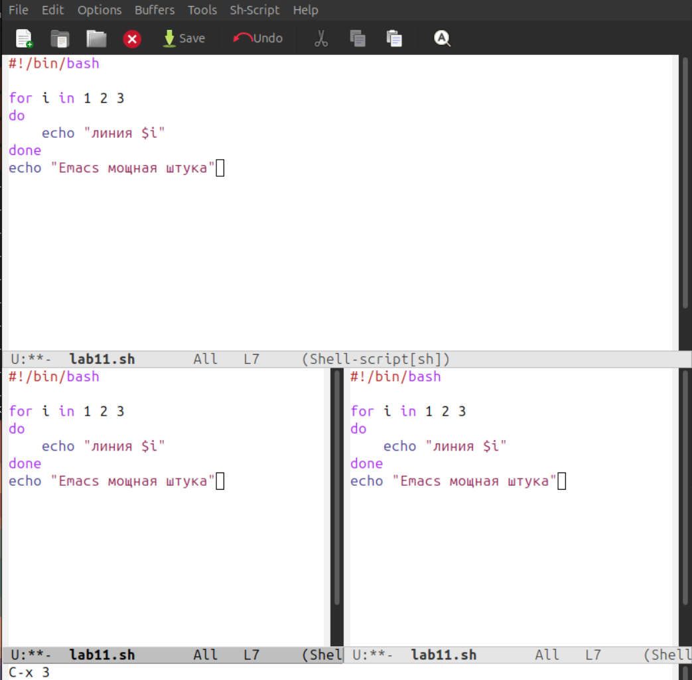
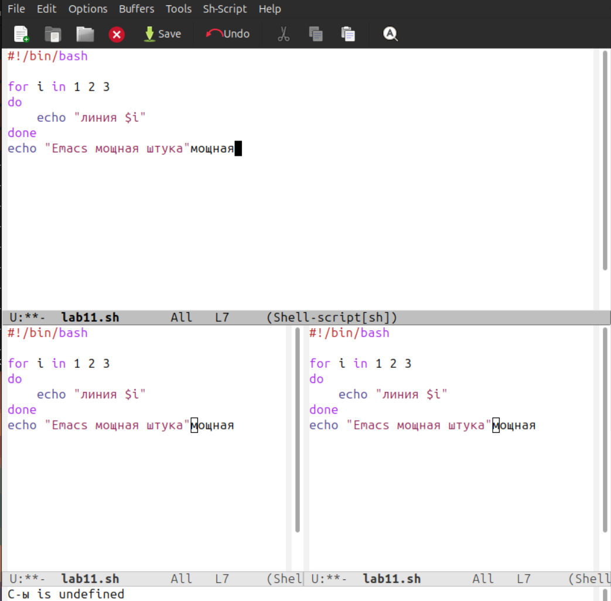

# Лабораторная работа №11
## Текстовой редактор emacs

**Студент:** Ибрахим Хиссеин Гана  
**Дата:** 25.04.2026

## Цель работы

Познакомиться с операционной системой Linux. Получить практические навыки работы с редактором Emacs.

## Выполнение работы

### 1. Установка и запуск Emacs

```bash
sudo apt install emacs -y
emacs &





2. Создание файла lab11.sh
C-x C-f → lab11.sh


3. Ввод содержимого



#!/bin/bash
echo "Emacs мощная штука"
for i in 1 2 3
do
   echo "линия $i"
done


4. Сохранение файла
C-x C-s



5. Управление буферами и окнами
Разделение окон: C-x 2, C-x 3

Переключение между окнами: C-x o

Список буферов: C-x C-b



6. Поиск и замена
Поиск: C-s

Замена: M-%



7. Завершение работы
C-x C-c

Выводы
В ходе работы были освоены основные команды Emacs:

открытие, сохранение файлов

управление буферами и окнами

поиск и замена текста

копирование, вырезание, вставка

## Ответы на контрольные вопросы

### 1. Кратко охарактеризуйте редактор emacs.
Emacs — мощный расширяемый редактор с поддержкой синтаксиса, множеством режимов и встроенных утилит (файловый менеджер, терминал, отладчик). Работает в графическом и текстовом режиме.

### 2. Какие особенности редактора могут сделать его сложным для новичка?
- Обилие комбинаций клавиш (C-x, C-c, M-x и др.)
- Собственная терминология (буфер, фрейм, минибуфер)
- Многофункциональность (может отвлекать)

### 3. Своими словами объясните, что такое буфер и окно в терминологии Emacs.
- **Буфер** — область памяти, содержащая текст (файл, сообщение, лог).
- **Окно** — область фрейма, отображающая буфер. Один буфер может быть открыт в нескольких окнах.

### 4. Можно ли открыть больше 10 буферов в одном окне?
Да, количество буферов не ограничено. Окно отображает только один буфер, но переключаться между ними можно (`C-x b`).

### 5. Какие буферы создаются по умолчанию при запуске Emacs?
- `*GNU Emacs*` (приветственный экран)
- `*scratch*` (черновик)
- `*Messages*` (системные сообщения)

### 6. Какие клавиши вы нажмёте, чтобы ввести следующую комбинацию: `C-c | C-c C-c`?
Сначала `Ctrl+c`, затем `|`, затем снова `Ctrl+c`.

### 7. Как поделить текущее окно на две части?
`C-x 2` (разделить горизонтально) или `C-x 3` (вертикально).

### 8. В каком файле хранятся настройки редактора emacs?
`~/.emacs` или `~/.emacs.d/init.el`.

### 9. Какую функцию выполняет клавиша `C-g`? Можно ли её переназначить?
`C-g` прерывает текущую команду. Да, через `global-set-key`.

### 10. Какой редактор вам показался удобнее в работе — vi или emacs? Почему?
(Ответ напиши сам, от своего имени. Например: «Emacs, потому что в нём удобнее работать с русским текстом и есть меню.»)
