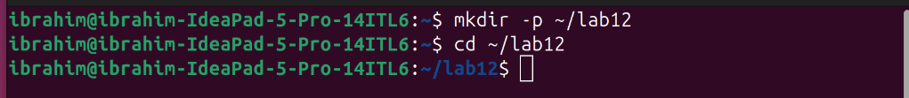
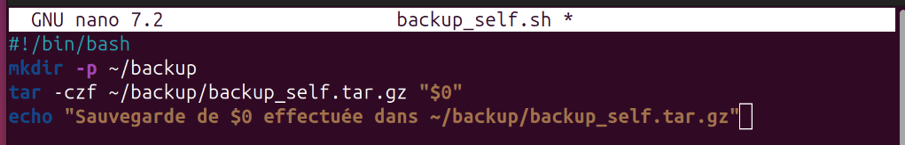
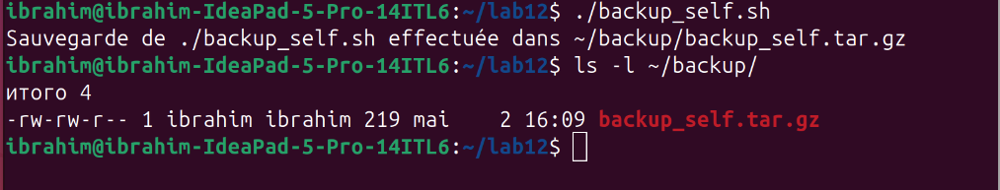
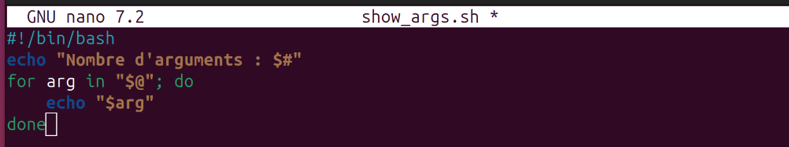
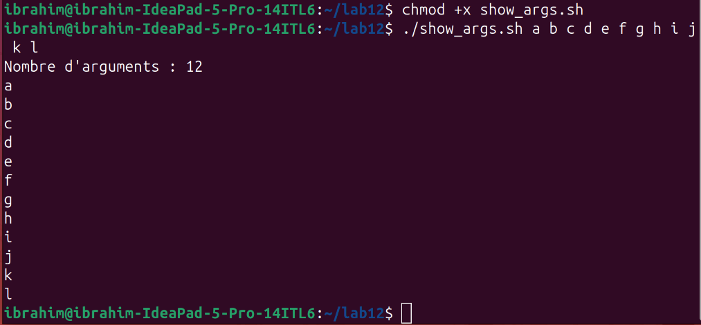
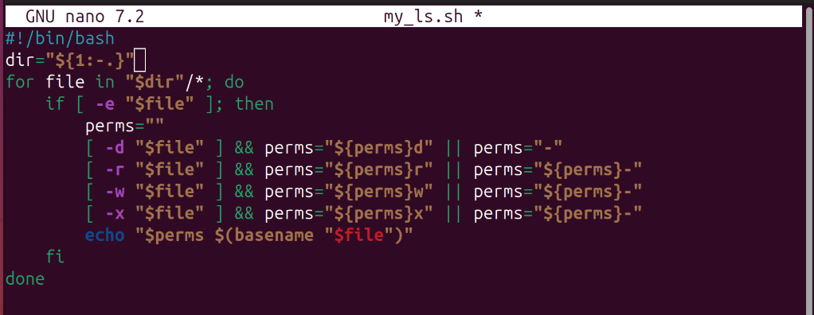
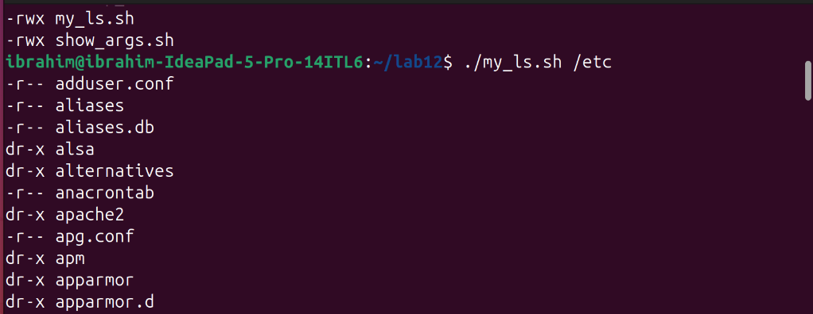
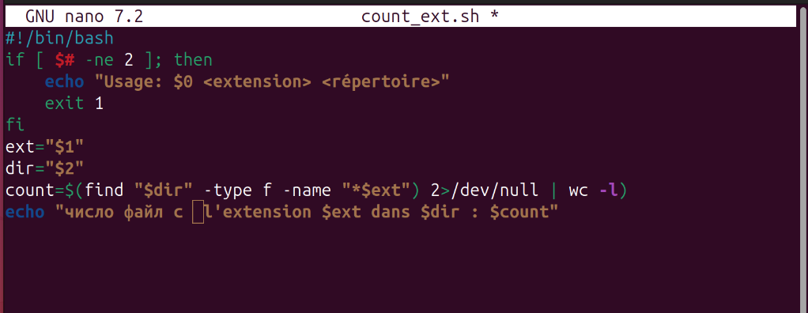
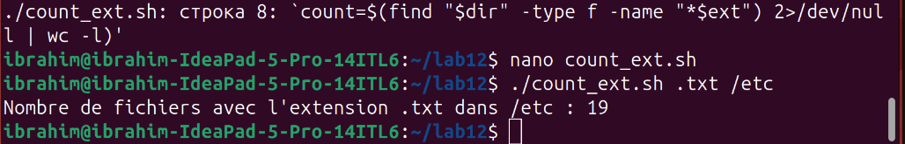

# Лабораторная работа №12
## Программирование в командном процессоре ОС UNIX

**Студент:** Ибрахим Хиссеин Гана  
**Дата:** 02.05.2026

## Цель работы

Изучить основы программирования в оболочке bash: переменные, циклы, условия, работа с аргументами, тестирование файлов.

## Выполнение работы

### 1. Создание рабочего каталога

```bash
mkdir -p ~/lab12
cd ~/lab12



2. Скрипт 1 : резервное копирование самого себя

nano backup_self.sh
Содержимое backup_self.sh:



Запуск и результат:

chmod +x backup_self.sh
./backup_self.sh
ls -l ~/backup/



3. Скрипт 2 : обработка произвольного числа аргументов

nano show_args.sh

Содержимое show_args.sh:



Запуск с 12 аргументами:

chmod +x show_args.sh
./show_args.sh a b c d e f g h i j k l



4. Скрипт 3 : аналог команды ls (без ls)

nano my_ls.sh

Содержимое my_ls.sh:



Запуск для текущего каталога и /etc:

chmod +x my_ls.sh
./my_ls.sh
./my_ls.sh /etc



5. Скрипт 4 : подсчёт файлов по расширению

nano count_ext.sh

Содержимое count_ext.sh (до/после исправления):



Запуск после исправления:

chmod +x count_ext.sh
./count_ext.sh .txt /etc



Выводы

В ходе работы были написаны и отлажены четыре bash-скрипта:

Резервное копирование самого себя.

Обработка произвольного количества аргументов.

Эмуляция команды ls с отображением прав доступа.

Подсчёт файлов заданного расширения в указанном каталоге.

Получены практические навыки работы с переменными, циклами, условиями, передачей параметров и тестированием файлов в оболочке bash.

Ответы на контрольные вопросы
1. Объясните понятие командной оболочки. Приведите примеры командных оболочек. Чем они отличаются?
Командная оболочка (shell) — программа, обеспечивающая интерфейс между пользователем и ОС. Примеры: sh (Bourne shell), bash (Bourne again shell), csh, zsh. Отличаются синтаксисом, возможностями (история, автодополнение, скрипты).

2. Что такое POSIX?
POSIX — набор стандартов, описывающих интерфейсы между ОС и прикладными программами, обеспечивающий переносимость на уровне исходного кода.

3. Как определяются переменные и массивы в языке программирования bash?
Переменная: var=value. Массив: arr=(val1 val2). Доступ: $var, ${arr[0]}.

4. Каково назначение операторов let и read?
let — для арифметических операций. read — чтение ввода пользователя в переменные.

5. Какие арифметические операции можно применять в языке программирования bash?
+, -, *, /, %, +=, -=, *=, /=, ++, --.

6. Что означает операция (( ))?
(( )) — выполнение арифметических операций в стиле C.

7. Какие стандартные имена переменных Вам известны?
HOME, PATH, USER, SHELL, PWD, PS1, IFS, LOGNAME.

8. Что такое метасимволы?
Символы, имеющие специальное значение для shell: *, ?, [ ], |, &, ;, ( ), { }, <, >,  (пробел), табуляция.

9. Как экранировать метасимволы?
С помощью \ (обратный слеш) или заключением в одинарные кавычки ' '.

10. Как создавать и запускать командные файлы?
Создать текстовый файл с #!/bin/bash, сделать его исполняемым (chmod +x), запускать: ./файл.

11. Как определяются функции в языке программирования bash?
function имя { команды; }

12. Каким образом можно выяснить, является файл каталогом или обычным файлом?
С помощью test -d (каталог) или test -f (обычный файл).

13. Каково назначение команд set, typeset и unset?
set — отображает и устанавливает переменные. typeset (или declare) — объявляет переменные с атрибутами. unset — удаляет переменные.

14. Как передаются параметры в командные файлы?
Параметры передаются через пробел после имени файла. Внутри скрипта доступны как $1, $2, ..., $9, ${10}, ${11}...

15. Назовите специальные переменные языка bash и их назначение.
$# — число аргументов

$*, $@ — все аргументы

$? — код возврата последней команды

$$ — PID оболочки

