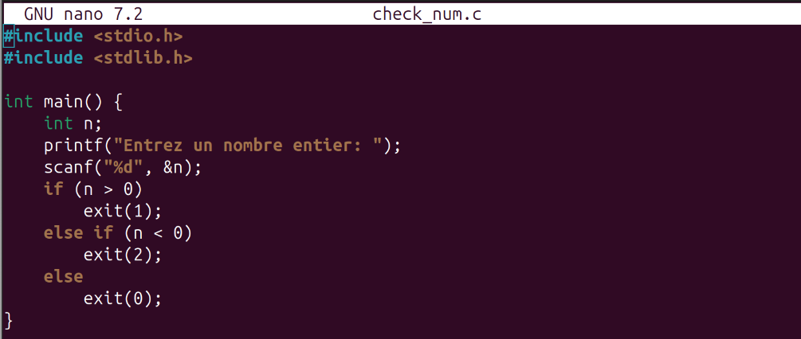

# Лабораторная работа №13 (11)
## Программирование в командном процессоре ОС UNIX. Ветвления и циклы

**Студент:** Ибрахим Хиссеин Гана  
**Дата:** 09.05.2026

## Цель работы

Изучить основы программирования в оболочке ОС UNIX. Научиться писать более сложные командные файлы с использованием логических управляющих конструкций и циклов.

---

## Выполнение работы

### 1. Скрипт с `getopts` (поиск строк в файле)

Файл `search.sh`:

```bash
#!/bin/bash
input=""
output=""
pattern=""
case_sensitive=""
line_numbers=""

while getopts ":i:o:p:Cn" opt; do
    case $opt in
        i) input="$OPTARG" ;;
        o) output="$OPTARG" ;;
        p) pattern="$OPTARG" ;;
        C) case_sensitive="-i" ;;
        n) line_numbers="-n" ;;
        \?) echo "Option invalide: -$OPTARG" >&2; exit 1 ;;
        :) echo "L'option -$OPTARG requiert un argument." >&2; exit 1 ;;
    esac
done

if [ -z "$input" ] || [ -z "$pattern" ]; then
    echo "Usage: $0 -i fichier_entree -p motif [-o fichier_sortie] [-C] [-n]"
    exit 1
fi

if [ -n "$case_sensitive" ]; then
    grep_cmd="grep $case_sensitive $line_numbers"
else
    grep_cmd="grep $line_numbers"
fi

if [ -n "$output" ]; then
    $grep_cmd "$pattern" "$input" > "$output"
    echo "Résultats écrits dans $output"
else
    $grep_cmd "$pattern" "$input"
fi

https://images/image.png

echo "Hello world" > test.txt
echo "hello again" >> test.txt
./search.sh -i test.txt -p world
./search.sh -i test.txt -p hello -C

https://images/image.png

2. Programme C + script bash (code de retour)
2.1. Programme C (check_num.c)

#include <stdio.h>
#include <stdlib.h>

int main() {
    int n;
    printf("Entrez un nombre entier: ");
    scanf("%d", &n);
    if (n > 0) exit(1);
    else if (n < 0) exit(2);
    else exit(0);
}



2.2. Script bash (test_num.sh)

#!/bin/bash
./check_num
case $? in
    0) echo "Le nombre est nul" ;;
    1) echo "Le nombre est positif" ;;
    2) echo "Le nombre est négatif" ;;
esac

https://images/image.png

Compilation et test:

gcc check_num.c -o check_num
./test_num.sh

https://images/image.png

3. Création / suppression de fichiers temporaires (files.sh

#!/bin/bash
if [ $# -ne 1 ]; then
    echo "Usage: $0 <N>  (créer N fichiers .tmp)"
    echo "Pour supprimer: $0 clean"
    exit 1
fi

if [ "$1" = "clean" ]; then
    rm -f [0-9]*.tmp
    echo "Fichiers .tmp supprimés."
    exit 0
fi

N=$1
for ((i=1; i<=N; i++)); do
    touch "$i.tmp"
done
echo "$N fichiers créés :"
ls -l [0-9]*.tmp 2>/dev/null || echo "Aucun fichier .tmp trouvé."

https://images/image.png

Tests:

chmod +x files.sh
./files.sh 5
./files.sh clean

https://images/image.png

4. Archivage des fichiers modifiés récemment (backup_recent.sh)

#!/bin/bash
if [ $# -ne 1 ]; then
    echo "Usage: $0 <répertoire>"
    exit 1
fi

dir="$1"
archive="backup_$(basename "$dir")_$(date +%Y%m%d).tar.gz"
find "$dir" -type f -mtime -7 -print0 | tar -czvf "$archive" --null -T -
echo "Archive créée : $archive"

https://images/image.png

mkdir -p testdir
touch testdir/oldfile
touch -d "2 days ago" testdir/recentfile
./backup_recent.sh testdir
ls -l backup_*.tar.gz

https://images/image.png

Выводы
В ходе работы были разработаны четыре скрипта:

Анализ командной строки с getopts и поиск строк.

Взаимодействие с программой на C через код возврата.

Создание и удаление большого количества временных файлов.

Архивация только недавно изменённых файлов с помощью find.

Получены навыки использования getopts, обработки кодов возврата, циклов и условных операторов в bash.

Ответы на контрольные вопросы
1. Каково предназначение команды getopts?
getopts анализирует опции командной строки в скриптах bash, позволяя легко обрабатывать короткие опции (например, -i, -o) и их аргументы.

2. Какое отношение метасимволы имеют к генерации имён файлов?
Метасимволы (*, ?, []) используются для шаблонов имён файлов (globbing). Например, *.txt соответствует всем файлам с расширением .txt.

3. Какие операторы управления действиями вы знаете?
if/then/else, case, for, while, until, break, continue, exit.

4. Какие операторы используются для прерывания цикла?
break – выход из цикла; continue – переход к следующей итерации.

5. Для чего нужны команды false и true?
true возвращает код 0 (успех), false возвращает ненулевой код (ошибка). Используются для организации бесконечных циклов или логических проверок.

6. Что означает строка if test -f man\$s/\$i.\$s, встреченная в командном файле?
Проверяет, существует ли файл man$s/$i.$s (значения переменных $s и $i подставляются). Обратный слеш экранирует $, чтобы не интерпретировать переменную внутри кавычек.

7. Объясните различие между конструкциями while и until.
while выполняет блок пока условие истинно (код возврата 0).
until выполняет блок до тех пор, пока условие не станет истинным (повторяет, пока ложно).
