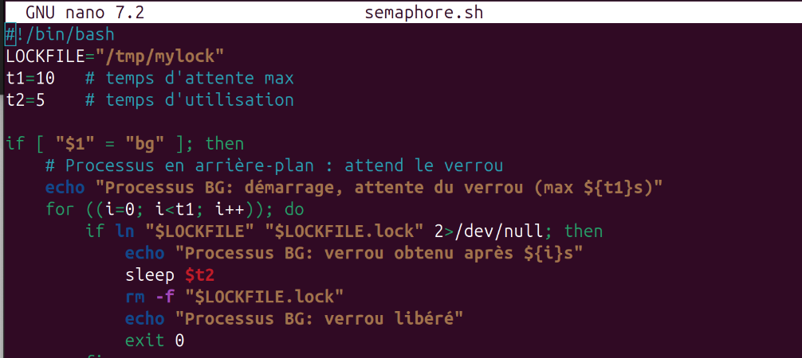
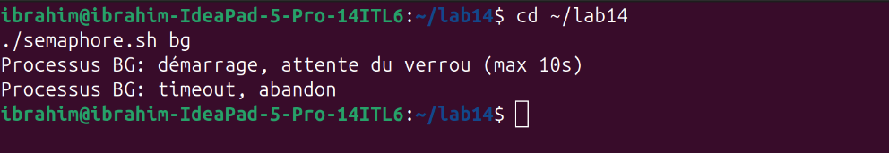
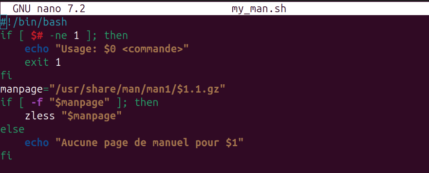
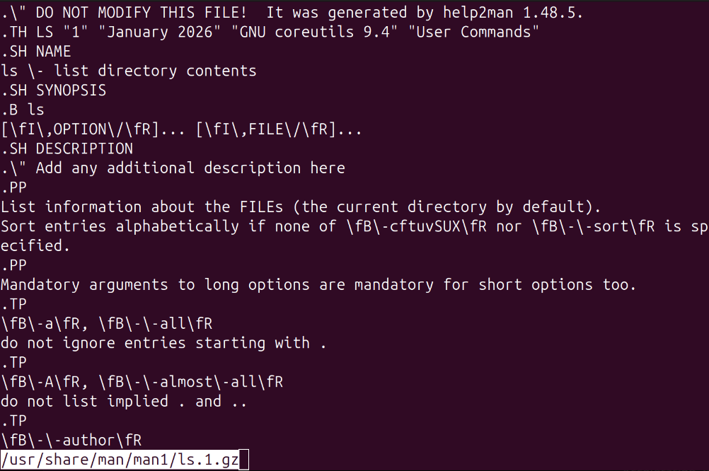
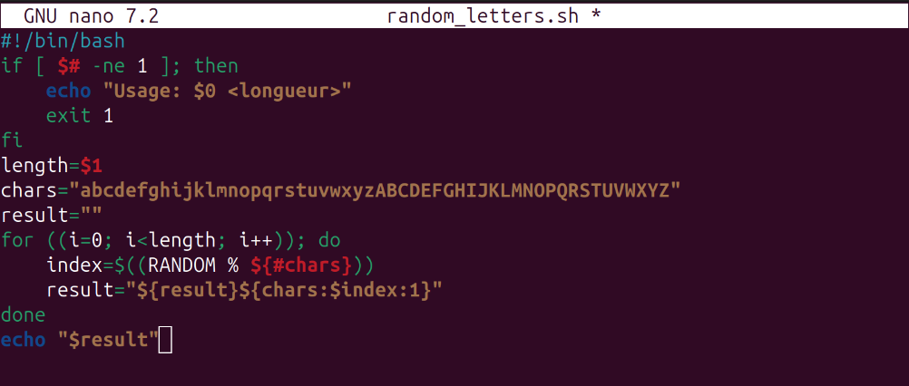
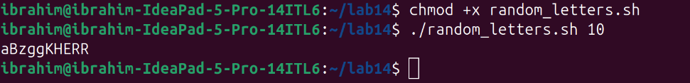

# Лабораторная работа №14
## Программирование в командном процессоре ОС UNIX. Ветвления и циклы (продолжение)

**Студент:** Ибрахим Хиссеин Гана  
**Дата:** 16.05.2026

## Цель работы

Изучить основы программирования в оболочке ОС UNIX. Научиться писать более сложные командные файлы с использованием логических управляющих конструкций и циклов.

---

## Выполнение работы

### 1. Семафоры (взаимодействие процессов)

Скрипт `semaphore.sh` (исправленная версия с таймером 15 секунд для FG):



**Результат**: процесс BG, запущенный во время работы FG, ожидал 10 секунд и завершился по таймауту (FG не освободил ресурс вовремя).



---

### 2. Реализация команды man

Скрипт `my_man.sh`:



**Тест**:

```bash
./my_man.sh ls



3. Генератор случайных букв
Скрипт random_letters.sh:



Тест (генерация 10 случайных букв):

./random_letters.sh 10


Выводы
В ходе работы были разработаны три скрипта:

Семафор – демонстрация ожидания ресурса между двумя процессами.

Собственная команда man – поиск и отображение сжатых страниц руководства.

Генератор случайных строк – использование переменной $RANDOM для создания буквенной последовательности.

Получены навыки работы с блокировками (символические ссылки), обработкой аргументов, чтением системных каталогов и генерацией случайных данных в bash.

Ответы на контрольные вопросы
1. Найдите синтаксическую ошибку в следующей строке:
while [\\$1 != "exit"]
Ошибка: не хватает пробелов вокруг != и внутри скобок. Правильно: while [ "$1" != "exit" ].

2. Как объединить (конкатенация) несколько строк в одну?
Использовать простое присваивание: new="$str1$str2" или new="${str1}${str2}".

3. Найдите информацию об утилите seq. Какими иными способами можно реализовать её функционал при программировании на bash?
seq генерирует последовательности чисел. В bash можно реализовать через цикл for ((i=1; i<=N; i++)).

4. Какой результат даст вычисление выражения $((10 / 3))?
Результат: 3 (целочисленное деление).

5. Укажите кратко основные отличия командной оболочки zsh от bash.
zsh имеет более мощное автодополнение

лучшую поддержку тем и плагинов

отличается синтаксисом некоторых операций (массивы, модули)

6. Проверьте, верен ли синтаксис данной конструкции:
for ((a=1; a <= LIMIT; a++))
Не хватает закрывающей )). Правильно: for ((a=1; a <= LIMIT; a++)).

7. Сравните язык bash с какими-либо языками программирования. Какие преимущества у bash по сравнению с ними? Какие недостатки?
Преимущества:

простота запуска внешних программ

работа с потоками ввода‑вывода

лёгкое управление файлами и процессами
Недостатки:

медленный для сложных вычислений

неудобная работа с числами с плавающей точкой

менее строгая типизация
